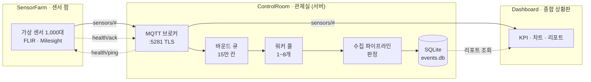
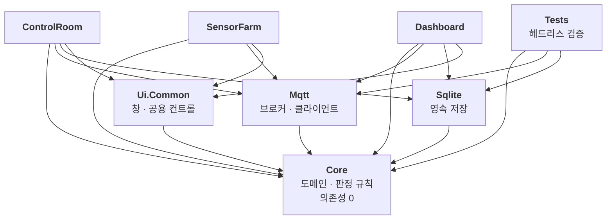
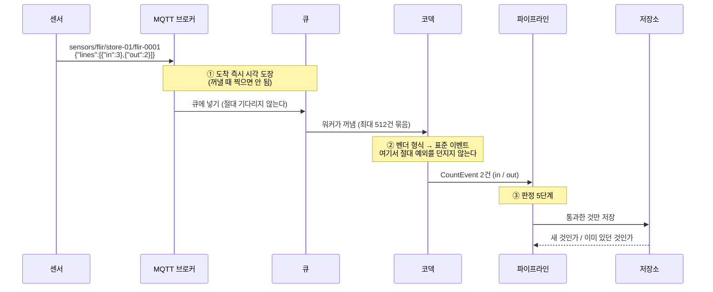
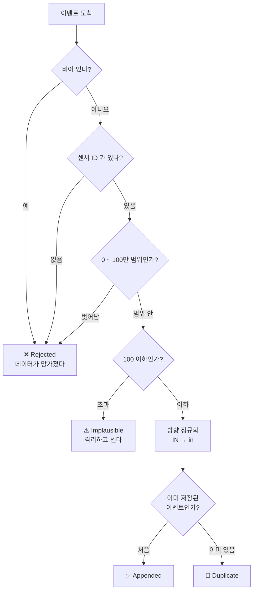
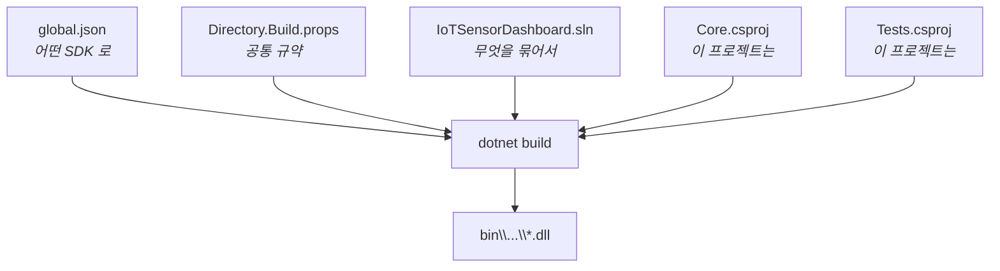
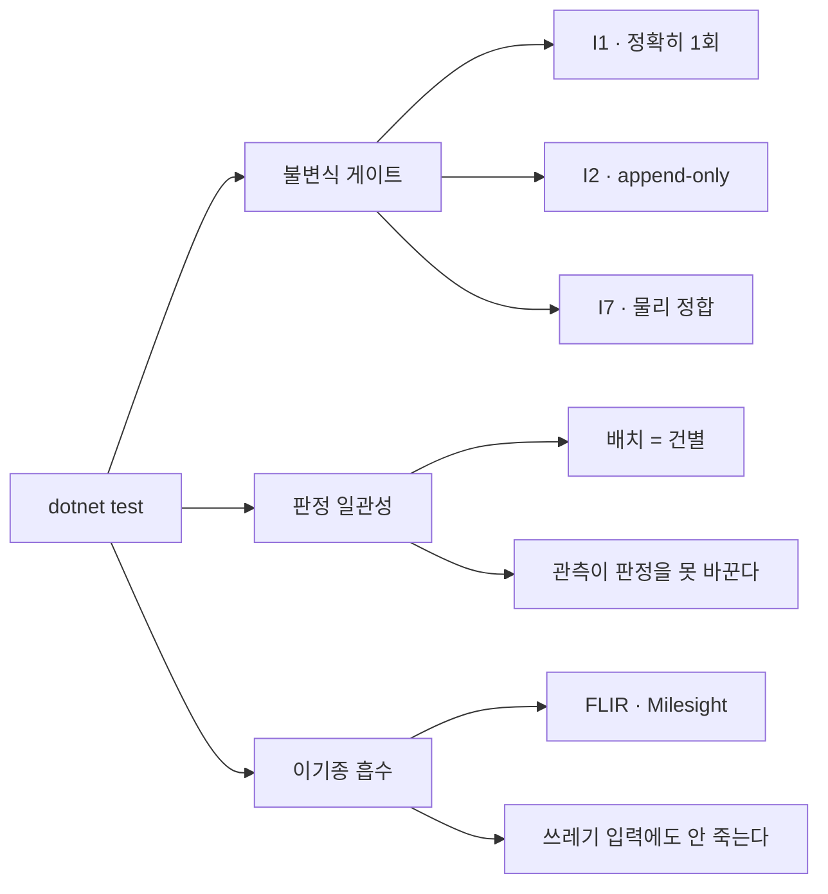
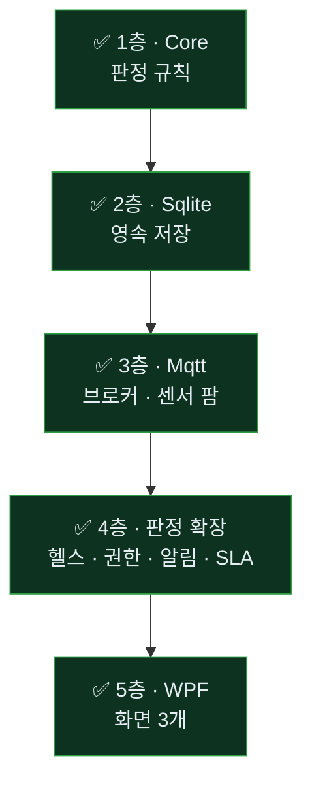

# 시스템 구조 지도

> 이 문서는 **코드를 읽지 않고도** 이 시스템이 무엇으로 이루어져 있고,
> 어떤 도구가 어디에 쓰이며, 데이터가 어디로 흐르는지 알 수 있게 쓴다.
>
> 코드 안쪽 설명은 각 소스 파일의 주석에 있다. 여기는 **지도**다.

---

## 1. 한 장으로 보는 전체 시스템

세 개의 Windows 데스크톱 프로그램이 **MQTT 라는 통신 규약**으로만 이어져 있다.



| 앱 | 정체 | 하는 일 |
|---|---|---|
| **SensorFarm** | 데이터 **발생원** | 센서 1,000대가 실제 MQTT 메시지를 발행. 오프라인·이상치·폭주를 사람이 만들 수 있다 |
| **ControlRoom** | **서버** | 브로커를 자기 안에 띄우고, 받은 걸 판정해서 저장. 센서 생사 감시, 장애 알림 |
| **Dashboard** | **소비자** | 같은 브로커를 구독해 화면을 그린다. 권한 범위 밖은 안 보여준다 |

### 왜 앱을 셋으로 나눴나

한 프로그램 안에서 "가짜 데이터 만들기 → 처리하기 → 보여주기"를 다 하면 편하다.
그런데 그러면 **증명할 수 있는 게 없다.**

- 센서 팜이 **진짜 MQTT 로 발행**하니까 "네트워크가 끊기면 어떻게 되나"를 실제로 재현할 수 있다
- 관제실이 죽었다 살아나면 나머지 둘이 **정말로 재연결하는지** 눈으로 볼 수 있다
- 대시보드가 브로커에 못 붙으면 **그 사실을 화면에 표시**하는지 확인할 수 있다

> 🔑 **센서 팜은 "테스트 도구"가 아니라 납품물이다.**
> 실제 센서 없이 이 시스템의 신뢰성을 증명하는 유일한 수단이기 때문이다.

---

## 2. 쓰는 도구와 각각의 자리

| 도구 | 어디에 쓰나 | 왜 이걸 골랐나 | 안 쓰면 |
|---|---|---|---|
| **.NET 8** | 전체 | Windows 데스크톱 + 순수 라이브러리를 한 언어로. 판정 층을 OS 비의존으로 뗄 수 있다 | — |
| **WPF** | 화면 3개 | 커스텀 렌더링(직접 그리기)이 자유롭다. 1,000개 타일을 매 프레임 그려야 한다 | WinForms 로는 이 수준의 렌더 제어가 어렵다 |
| **MQTTnet** | 앱 간 통신 | **브로커를 앱 안에 내장**할 수 있다 → 외부 서버 설치가 필요 없다 | Mosquitto 등을 따로 설치·설정해야 하고, 그 순간 "exe 만 실행하면 되는" 재현성이 깨진다 |
| **SQLite** | 저장 | 파일 하나. 설치·계정·포트가 없다. 세 종류 기록(이벤트·장애·감사)이 **같은 파일**에 공존 | 서버 DB 를 쓰면 데모마다 환경 구축이 필요하다 |
| **xUnit** | 검증 | 앱을 띄우지 않고 판정 규칙만 헤드리스로 돌린다 | 규칙이 맞는지 **화면을 보고 판단**하게 되고, 그건 검증이 아니다 |
| **git / GitHub** | 이력 | "왜 그렇게 정했는지"를 커밋 메시지에 남긴다 | 근거가 사라지면 다음 사람이 같은 함정에 빠진다 |

### 🚫 일부러 **안** 쓰는 것

| 안 쓰는 것 | 대신 | 이유 |
|---|---|---|
| **차트 라이브러리**<br/>(LiveCharts · OxyPlot 등) | `OnRender` 로 직접 그리기 | 그리는 빈도를 우리가 통제해야 한다. 라이브러리는 "부하가 없을 때 CPU 도 안 쓴다"를 보장해 주지 않는다 |
| **설정 파일**<br/>(appsettings.json) | C# 상수 | 수치 하나하나에 실측 근거가 붙어 있다. 밖에서 바꿀 수 있게 만들면 그 근거가 사라진 채로 바뀐다 |
| **MQTT retain 플래그** | 미사용 | retain 은 "마지막 값을 브로커가 붙잡고 있다가 새 구독자에게 준다"이다. 그러면 **죽은 센서의 마지막 값이 방금 온 값처럼 보인다** |
| **ORM**<br/>(EF Core 등) | 직접 SQL | 삽입 경로가 초당 수만 건이다. 어떤 쿼리가 나가는지 눈에 보여야 한다 |

---

## 3. 프로젝트를 어떻게 쪼갰나

최종 형태는 프로젝트 **8개**다. 화살표는 "참조한다" = "이쪽 코드를 쓴다".



### 규칙은 세 줄이 전부다

**① Core 는 아무것도 참조하지 않는다**

WPF 도, MQTT 라이브러리도, DB 드라이버도 안 들어온다. 외부 패키지 0개.

> **왜**: 판정 규칙("이 이벤트를 받아들일 것인가", "이 센서는 죽었는가", "이 사람이 이걸 봐도 되는가")이
> 전부 Core 에 있다. Core 가 순수해야 **앱을 안 띄우고** 그 규칙들을 검증할 수 있다.
>
> 판정이 화면 코드에 섞이는 순간 자동 검증이 불가능해지고,
> **검증할 수 없는 판정은 조용히 틀린다.**

**② 화살표는 한 방향으로만 흐른다**

`Core → Mqtt` 같은 역방향은 금지. Core 는 자기를 누가 쓰는지 몰라야 한다.

**③ 앱끼리는 코드로 참조하지 않는다**

세 앱은 서로의 함수를 부르지 않는다. **유일한 통신 수단은 MQTT.**

> **왜**: 앱이 서로를 직접 참조하면 "같은 PC 에서만 도는" 물건이 된다.
> MQTT 로만 이으면 나중에 센서 팜을 다른 기계로 옮겨도 그대로 돈다.

### 층의 성격

```
                순수한 쪽                             더러운 쪽
    ┌──────────────────┬─────────────────────┬──────────────────┐
    │      Core        │  Mqtt · Sqlite      │   앱 3개          │
    │  규칙 · 판정      │  바깥 세계와의 접점   │  화면 · 사람      │
    │  테스트하기 쉬움   │  통합 테스트 필요     │  눈으로 확인      │
    └──────────────────┴─────────────────────┴──────────────────┘
```

**"이 숫자가 틀리면 큰일 나는" 판정은 전부 왼쪽으로 꺼낸다.**
오른쪽에 남아 있으면 검증할 수 없고, 검증 없는 판정은 언젠가 거짓말을 한다.

---

## 4. 지금까지 만든 것 — Core · Sqlite

```
S:\IoTSensorDashboard\
│
├── 📄 global.json              어떤 .NET SDK 로 빌드할지 고정
├── 📄 Directory.Build.props    모든 프로젝트 공통 규약
├── 📄 IoTSensorDashboard.sln   프로젝트 묶음 목록
│
├── 📁 src\IoTSensorDashboard.Core\        ← 규칙을 소유한 층 (의존성 0)
│   ├── Domain\        "무엇이 존재하는가"      CountEvent · Site · Sensor · Role
│   ├── Ingestion\     "받아들일 것인가"        파이프라인 · 판정 · 지표 · 토픽 규약
│   ├── Codecs\        "이 바이트가 무슨 뜻인가" FLIR · Milesight 해석기
│   ├── Storage\       "어떻게 보관하는가"      저장 계약 · 보존 정책 · 인메모리
│   ├── Health\        "살아 있는가"            적응 임계 · 생사 판정 (I5)
│   ├── Authorization\ "누가 뭘 볼 수 있는가"    조직 트리 · 스코프 (I4)
│   ├── Notification\  "누구에게 언제 알리는가"  사다리 · 통지 계약 · 파일 통지
│   ├── Reporting\     "얼마나 잘 돌았는가"      가동률 · MTTR · 관측 판정
│   ├── Aggregation\   "어떻게 묶는가"          시간별 집계 (I3)
│   ├── Provisioning\  "있어야 할 것은 무엇인가"  조직·센서 명부 (I5 의 분모) · 연락처
│   ├── Audit\         "누가 무엇을 봤는가"     감사 계약
│   └── Simulation\    "무엇을 내보낼 것인가"   발행 페이로드 생성
│
├── 📁 src\IoTSensorDashboard.Sqlite\      ← 실제로 파일에 쓰는 층
│   ├── SqliteSchema.cs        테이블 4개 · 연결 설정(PRAGMA)
│   ├── SqliteEventStore.cs    이벤트 · 롤업/프룬 · 공간 회수 · SQL 집계
│   ├── SqliteOutageLog.cs     장애 이력
│   └── SqliteAuditLog.cs      감사 로그
│
├── 📁 src\IoTSensorDashboard.Mqtt\        ← 앱끼리 이어 주는 층
│   ├── EmbeddedMqttBroker.cs  앱 안에서 도는 브로커
│   ├── DevTls.cs              런타임 생성 자체서명 인증서
│   ├── MqttReconnect.cs       연결될 때까지 무한 재시도 ⭐
│   ├── MqttIngestionSource.cs 구독 채널 (수신만)
│   ├── MqttSensorPublisher.cs 발행 클라이언트 (팜)
│   ├── MqttHealthProbe.cs     생존 확인 (관제실)
│   └── SensorFarmEngine.cs    버퍼 · 백필 · 폐기 계수 · 이상치
│
└── 📁 tests\IoTSensorDashboard.Tests\     ← 규칙이 깨졌는지 감시
    ├── InvariantGates\  절대 깨지면 안 되는 것
    ├── Ingestion\       판정이 일관적인가 · 토픽 규약
    ├── Codecs\          이기종을 제대로 흡수하는가
    ├── Storage\         영속 저장이 계약대로인가
    ├── Provisioning\    명부가 결정적인가 (I5 의 분모)
    └── Mqtt\            실제 브로커를 띄워서 왕복·TLS·재연결
```

### 폴더별로 무슨 일을 하나

| 폴더 | 한 줄 | 대표 파일 |
|---|---|---|
| **Domain** | 이 세계에 무엇이 존재하는지 정의 | `CountEvent` — 센서가 센 한 순간 |
| **Ingestion** | 들어온 걸 받아들일지 판정 | `IngestionPipeline` — 이 층의 심장 |
| **Codecs** | 벤더마다 다른 형식을 표준으로 번역 | `FlirCodec` · `MilesightCodec` |
| **Storage**(Core) | 어떻게 보관할지의 **약속**과 **정책** | `IEventStore` · `RetentionPolicy` |
| **Simulation** | 발행할 메시지 형식의 단일 소스 | `VendorPayloadFactory` |
| **Sqlite** | 그 약속의 **실제 구현** | `SqliteEventStore` |

### 🔑 Core 의 `Storage` 와 Sqlite 프로젝트가 나뉜 이유

```
Core/Storage/     "무엇을 보장하는가"  → IEventStore(수정 표면 없음) · RetentionPolicy(언제 정리할지)
Sqlite/           "어떻게 해내는가"    → INSERT OR IGNORE · 트랜잭션 · PRAGMA · SQL
```

**"3시간 지나면 정리한다"는 규칙**은 SQLite 와 무관하다. PostgreSQL 로 바꿔도 그대로다.
그래서 정책은 Core 에 있고, **DB 를 안 띄우고도 검증**할 수 있다.

반대로 `INSERT OR IGNORE` 같은 건 SQLite 고유의 방법이라 Sqlite 프로젝트에 있다.

> 📌 판별법: **"DB 를 바꿔도 그대로인가?"** → 그렇다면 Core 로.

---

## 5. 데이터가 흐르는 길

센서가 사람을 세는 순간부터 저장될 때까지.



### 각 지점에서 지키는 것

| # | 지점 | 규칙 | 어기면 |
|---|---|---|---|
| ① | 큐에 넣기 | **도착 시각**을 그 자리에서 찍는다 | 큐가 밀리면 죽은 센서가 살아 있는 것으로 보인다 |
| ① | 큐에 넣기 | 큐가 차도 **기다리지 않는다** (오래된 것부터 버림) | 브로커가 재전송을 시작해 잼이 고착된다 |
| ① | 버릴 때 | **버린 개수를 반드시 센다** | 폐기가 흔적 없이 사라진다 |
| ② | 코덱 | 망가진 payload 에도 **예외를 던지지 않는다** | 한 건이 수집 루프 전체를 멈춘다 |
| ② | 코덱 | 한 라인이 깨져도 **형제 라인은 살린다** | 데이터가 있는데 안 세게 된다 |
| ③ | 판정 | 순서를 바꾸지 않는다 | "망가진 값"과 "불가능한 값"이 섞인다 |

---

## 6. 판정 — 받아들일 것인가

파이프라인이 이벤트 하나를 보고 내리는 결정.



### 결과 4종을 왜 나눠 두나

| 결과 | 뜻 | 누구 잘못 | 화면에서 |
|---|---|---|---|
| `Appended` | 새로 저장됨 | — | 정상 |
| `Duplicate` | 이미 센 값이라 무시 | — | **정상** (재전송은 당연히 일어난다) |
| `Rejected` | 데이터가 망가졌다 | 보내는 쪽 버그 | 경고 |
| `Implausible` | 형식은 맞는데 현실적으로 불가능 | 센서 글리치 | 경고 (별도) |

> 🔒 **`Rejected` 와 `Implausible` 을 합치면 안 된다.**
> 전자는 "코드를 고쳐야 한다", 후자는 "센서를 점검해야 한다"이다. 대응이 다르다.

### 두 숫자의 의미

| 상수 | 값 | 무엇 |
|---|---|---|
| `MaxCount` | **1,000,000** | 오버플로 방지선. 없으면 악성 값 하나가 집계 합을 망가뜨리고, 저장이 append-only 라 지울 수도 없다 |
| `MaxPlausible…` | **100** | 물리적 한계선. 출입구 하나를 한 순간에 100명이 지나갈 수는 없다 |

---

## 7. 빌드 도구 — 이 파일들이 각각 뭐하는 놈인가

C# 프로젝트를 처음 보면 정체불명의 파일이 여럿 보인다. 각자 역할이 다르다.



| 파일 | 답하는 질문 | 여기 뭘 넣었나 |
|---|---|---|
| **global.json** | 어떤 **SDK 버전**으로 빌드하나 | .NET 8 고정. 머신마다 다른 버전으로 빌드되면 "내 PC 에선 되는데"가 생긴다 |
| **Directory.Build.props** | 모든 프로젝트가 **공통으로** 지킬 것 | nullable 검사 켜기 · **경고를 오류로 취급** |
| **\*.sln** | 어떤 프로젝트들을 **한 덩어리**로 보나 | Core + Tests (앞으로 8개까지) |
| **\*.csproj** | 이 프로젝트 **하나**의 설정 | 대상 프레임워크 · 참조할 패키지 |
| **.gitignore** | git 이 **무시할** 것 | 빌드 산출물(`bin`, `obj`) · 로컬 DB |

### 왜 "경고를 오류로" 켰나

인수 기준이 **"오류 0 · 경고 0"** 이다. 그런데 경고는 그냥 두면 쌓인다.
쌓이면 아무도 안 본다. 안 보면 **진짜 신호가 묻힌다.**

> 그래서 약속으로 두지 않고 **빌드가 강제하게** 했다.
> 경고가 하나라도 나면 빌드가 실패하므로, 그때그때 처리할 수밖에 없다.

같은 발상이 코드에도 있다 — `IEventStore` 에 `Update`·`Delete` 메서드를 두지 않은 것도
"수정하지 말자"는 약속 대신 **수정할 방법 자체를 없앤** 것이다.

---

## 8. 테스트가 잠그고 있는 것

테스트 **84건**. 앱을 띄우지 않고 몇 밀리초 만에 돈다.



| 게이트 | 무엇을 막나 | 대표 검사 |
|---|---|---|
| **G-I1** | 재전송·순단에서 숫자가 새거나 두 번 세지는 것 | 64개 스레드가 동시에 같은 이벤트를 넣어도 **저장은 1건** |
| **G-I2** | 나중에 원본이 바뀌는 것 | 값을 바꿔 재전송해도 **최초본이 남는다** · 계약에 수정 메서드가 **없는지 검사** |
| **G-I7** | 센서 글리치가 통계를 망치는 것 | 500 은 격리 · **100 은 통과**(경계) · 음수와 구분 |
| **배치 등가** | 성능을 위해 묶었더니 결과가 달라지는 것 | 같은 입력을 건별/묶음으로 넣어 **결과 배열 비교** |
| **관측 비침투** | 지표를 켜니까 숫자가 달라지는 것 | 일부러 **예외를 던지는 관측자**를 꽂아도 판정 불변 |

### 테스트 이름을 한국어로 쓴 이유

```
저장_실패는_중복으로_보고되지_않는다
큐_대기_메시지가_죽은_센서를_되살리지_않는다
```

테스트 이름이 곧 **"이 시스템이 지키는 약속"의 목록**이다.
영어로 쓰면 읽는 데 한 번 더 힘이 들고, 그러면 아무도 목록을 읽지 않는다.

---

## 9. 앞으로 붙을 것



| 층 | 무엇 | 새로 쓰는 도구 |
|---|---|---|
| ~~2층~~ | ~~파일에 저장 · 오래된 건 집계로 접기 · 공간 회수~~ | SQLite · 트랜잭션 · WAL |
| ~~3층~~ | ~~진짜 메시지를 주고받기 · 끊겨도 다시 붙기~~ | MQTTnet · TLS · 비동기 |
| ~~4층~~ | ~~센서 생사 · 권한 경계 · 통지 사다리 · 가동률~~ | **없음 — 전부 순수 로직** |
| ~~5층~~ | ~~화면 · 직접 그리기 · 60fps 를 쓰지 않는 법~~ | WPF · `OnRender` |

> 🔑 **4층에 새 도구가 하나도 없다는 것**이 이 설계의 결과다.
> 「이 숫자가 틀리면 큰일 나는」 판정을 전부 Core 로 꺼냈기 때문에,
> 가장 중요한 규칙들이 **DB 도 네트워크도 화면도 없이** 검증된다.

각 층은 **아래층을 참조하지만 위층을 모른다.**
그래서 2층을 만들 때 1층은 손대지 않고, 5층을 만들 때 1층 테스트는 그대로 돈다.

---

## 한 줄 요약

> **바깥세상(MQTT · DB · 화면)은 갈아 끼울 수 있게 만들고,
> 절대 틀리면 안 되는 판정만 가운데(Core)에 모아 자동으로 감시한다.**
